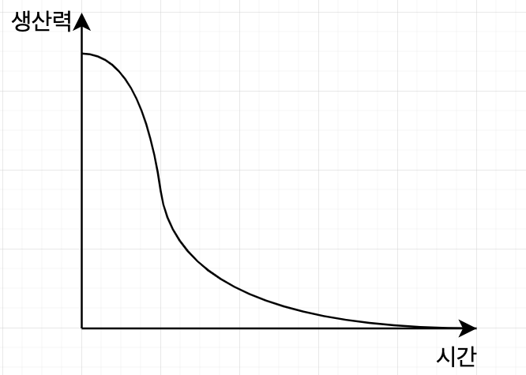

> 이 책은 좋은 프로그램 작성 요령을 설명하는 책이다.

- 코드는 요구사항을 표현하는 언어이다.
프로그래밍을 할 때 모델이나 요구사항에 집중해야 한다는 것에 다들 공감한다.
결국은 모델이나 요구사항을 최종적으로 표현하는 것은 코드이다. 뛰어난 모델 설계와 요구사항 분석이 되어도 잘못된 코드로 표현이 된다면 앞선 선행의 의미가 떨어지게 된다.

우리 모두는 좋은 코드가 중요하다는 사실을 안다. 왜? **오랫동안 나쁜 코드에 시달려왔으니까.**

- 제품의 업데이트가 점점 늦춰지는 이유
- 이전에 발생한 버그가 계속 재발하는 이유
- 프로그램이 죽는 이유
- 프로그램 성능이 느려지는 이유
위 4가지 모두 나쁜코드로 인해서 발생한다. 나쁜코드는 점점 더 지속적으로 나빠진다. 그러다 감당하기 어려운 수준에 이른다.
나쁜코드는 이처럼 우리의 발목을 지속적으로 잡는다. (고행wading 이라고 부른다.)

왜 나쁜코드를 작성하게 되는가?
- 급해서, 서두르느라
	- 제대로 짤 시간이 없다고 생각해서, 코드를 다듬느라 시간을 보낼수가 없다.
- 지겨워서
- 다른 업무가 너무 밀려서 후딱 해치우고 밀린 업무로 넘어가려고...

**일단 얼른 돌아가도록 짜고, 부족한 부분은 다음에 시간이 있을 때 수정해야겠다.**
-> 그런 나중은 잘 오지 않는다..

### 나쁜 코드로 치르는 대가
1. 나쁜 코드는 개발 속도를 크게 떨어뜨린다.
2. 매번 코드를 '해독'해야 한다.
3. 생산성이 떨어진다.
4. 새로운 인력의 투입이 어렵다.

코드를 결국 재설계할 때 기존 시스템도 유지보수 해야하며, 기존 시스템에 가해지는 변경도 모두 따라잡아야 한다. (새 시스템이 기존 시스템을 100% 제공하지 못하면 관리층은 기존 시스템을 대체하지 않는다.)
이 과정은 쉽지 않고, 오래걸리기 때문에 중간중간 이탈자가 생기기 마련이다. 

코드가 엉망이면 몇 시간으로 예상한 업무도 몇 주로 늘어지기도 한다.
몇 줄만 고치면 될 것이라고 예상했지만 모듈을 수백 개 건드린 경험이 있다.

마케팅 부서와 관리자, 고객이 우리에게 요구하는것은 그들의 역할이고, 책임이기 때문이다.
우리는 그들에게 정보를 제공할 의무가 있으며, 좋은 코드를 유지하고, 사수하기 위해서 노력해야할 것은 프로그래머들의 책임이다.

프로그래머로서 책임을 저버리고, 나쁜 코드의 위험을 관리자들에게 전달하지 못하고, 그들의 말대로 그저 따르는 행동 자체가 전문가 답지 못한 것이다.

기한을 맞추기 위해서 어쩔 수 없이 나쁜코드를 생산했다는 말은 틀렸다. 기한을 맞추는 유일한 방법은 코드를 최대한 옳바른 상태로 유지하는 습관이다. 

이제 나쁜 코드의 문제점을 확실히 이해했다고 가정한다.
또 빨리 가기 위해선 나쁜 코드를 구분할 줄 안다고 깨끗한 코드를 작성할 줄 안다는 뜻은 아니다.

깨끗한 코드를 작성하려면 '청결'이라는 힘겹게 습득한 감각을 활용해 자잘한 기법들을 적용하는 절제와 규율이 필요하다. 열쇠는 '코드 감각'이다. 이 코드 감각을 타고나는 사람도 있고, 투쟁을 통해서 얻어야 하는 사람도 있다. 코드 감각이 있는 프로그래머는 나쁜 모듈을 보면 좋은 모듈로 개선할 방안을 떠올린다. 이 감각으로 최고의 방안을 선택한 후 여기서 거기까지 이동하는 경로를 계획한다.

### 깨끗한 코드란?
#### 비야네 스트롭스트룹 (C++의 창시자)
- 논리가 간단해야 버그가 숨어들지 못한다.
- 의존성을 최대한 줄여야 유지보수가 쉬워진다.
- 오류는 명백한 전략에 의거해 철저히 처리한다.
- 성능을 최적으로 유지해야 사람들이 원칙 없는 최적화로 코드를 망치려는 의혹에 빠지지 않는다.
- **깨끗한 코드는 한 가지를 제대로 한다.**

- 나쁜코드는 나쁜코드를 유혹한다.

#### 그래디 부치
- 깨끗한 코드는 단순하고 직접적이다.
- 잘 쓴 문장처럼 읽힌다.
- 의도를 숨기지 않고, 오히려 명쾌한 추상화와 단순한 제어문으로 가득하다.

#### 큰 데이브 토마스
- 깨끗한 코드는 읽기 쉽고, 고치기 쉽다.
- 단위 테스트와 인수 테스트가 존재한다.
- 깨끗한 코드에는 의미 있는 이름이 붙는다.
- 한가지 기능만 제공한다.
- 의존성이 최소이며 각 의존성을 명확히 정의한다.

#### 마이클 페더스
- 깨끗한 코드는 언제나 누군가 주의 깊게 짰다는 느낌을 준다.
- 고치려고 살펴봐도 손 댈 곳이 없다.

#### 론 제프리스
- 중복을 피하라
- 한 기능만 수행하라
- 제대로 표현하라
- 작게 추상화하라

#### 워드 커닝햄
- 코드를 읽으면서 짐작하는대로 기능이 동작해야 한다.

#### 저자
- 코드를 짜기 위해서 코드를 읽는다. 그러므로 읽기 쉬운 코드를 작성해야 한다.

##### 보이스카우트 규칙
체크아웃할 때보다 좀 더 깨끗한 코드를 체크인한다면 절대 나빠지지 않는다.    
시간이 갈수록 좋아지는 프로젝트

##### 프리퀄과 원칙
PPP(SRP, OCP, DIP)